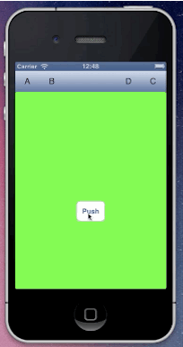
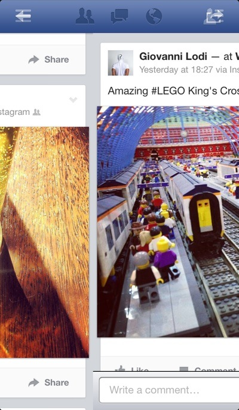

# MSSlideNavigationController

Facebook like UINavigationController to slide back to previous view controller.

## Get it ready

The best way to add it inside your project is with [CocoaPods](http://cocoapods.org/): simply add

    pod 'MSSlideNavigationController'

inside your Podfile. 

## Origins and how it works

`MSSlideNavigationController` is a subclass (and a kind of *hack*!) of `UINavigationController`. It was originally created by the hacker [@chpwn](https://twitter.com/chpwn) for Facebook:

<blockquote class="twitter-tweet" lang="it">
@<a href="https://twitter.com/aaronash">aaronash</a> you should try the swipe back gesture I did for the latest Facebook update
&mdash; Grant Paul (chpwn) (@chpwn) <a href="https://twitter.com/chpwn/status/334061769364492289">13 maggio 2013</a></blockquote>

And the response was quite good:

<blockquote class="twitter-tweet" lang="it">
Dynamic swipe back behaviour in UINavigationControllers (like Flurry and the new Facebook app update) need to be a thing. They're awesome.
&mdash; Adam Bell (@b3ll) <a href="https://twitter.com/b3ll/status/334291351829110784">14 maggio 2013</a></blockquote>

I don't know about Grant Paul's implementation, but mine works creating a screenshot of the previous view controller as soon as the user starts scrolling, animating bar button items based on user's scroll.

## How to use

Whenever you want to add this feature to your navigation controller's hierarchy, you have to do a couple of things.

First of all, use `MSSlideNavigationController` instead of `UINavigationController` (course)

If you want the fade animation for bar button items (and I am sure you do want it), the only way is to create them with a custom view, adding the actual view as a subview of the "main" custom view. An example is probably what you need:

    UIButton *button = [[UIButton alloc] initWithFrame:CGRectMake(0, 0, 44, 33)];
    [button setTitle:@"A" forState:UIControlStateNormal];
    [button setTitleColor:[UIColor blackColor] forState:UIControlStateNormal];
    [button addTarget:self action:@selector(yourAction) forControlEvents:UIControlEventTouchUpInside];
    UIView *view = [[UIView alloc] initWithFrame:button.frame];
    [view addSubview:button];
    UIBarButtonItem *barButtonItem = [[UIBarButtonItem alloc] initWithCustomView:view];

And remebember to keep bar button items' sizes constant.

## Credits

Freely inspired by Facebook

## Contact

Marco Sero

- http://www.marcosero.com
- http://twitter.com/marcosero 
- marco@marcosero.com

## License

MSSlideNavigationController is available under the MIT license. See the LICENSE file for more info.

